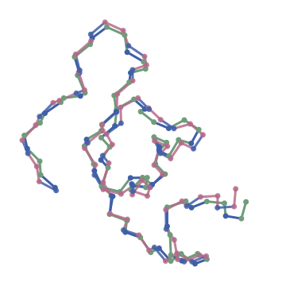
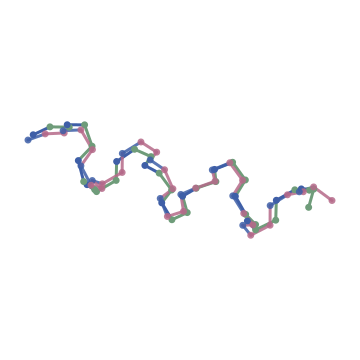
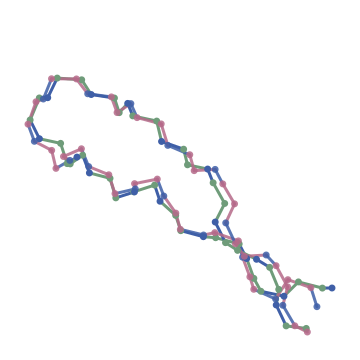
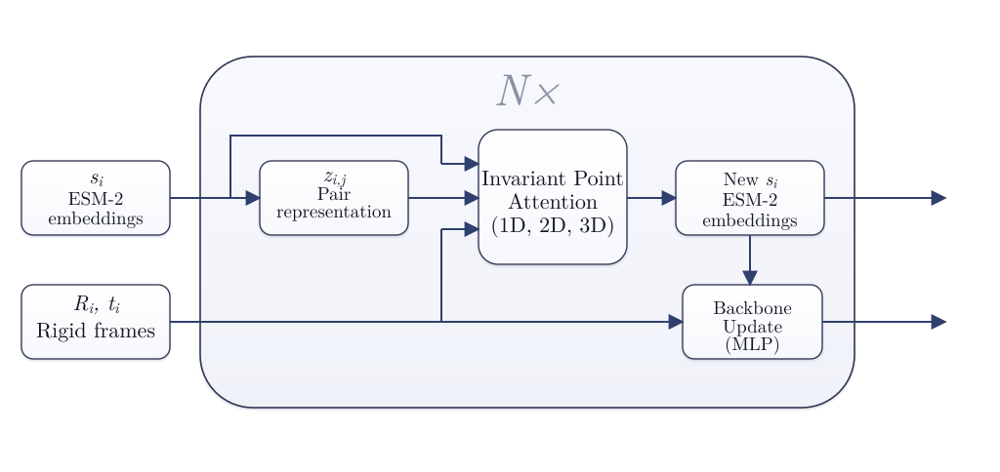

<p align="center">
  
</p>
<p align="center"><i>Geometric deep learning for short peptide backbone prediction.</i><br>
ESM-2 (frozen) → simplified Invariant Point Attention → backbone frames → FAPE.</p>

<p align="center">
  <b><span style="font-size: 1.5em;">&rarr;</span> <a href="https://pepert03.github.io/microfold//" style="font-size: 1.25em;">live demo</a> <span style="font-size: 1.5em;">&larr;</span></b>
</p>

---

## What it does

Given a peptide sequence (≤ 30 residues, canonical AAs), microfold predicts per-residue rigid frames `(R, t)` for the protein backbone. Truth comes from the experimental PDB structure cached from [DBAASP](https://dbaasp.org/), targets are built as N–CA–C frames, and the model is trained with FAPE plus a peptide-bond regulariser (and an optional steric-clash term).

Validation RMSD on the best Optuna trial reaches **2.84 Å mean / 2.59 Å median** over 44 held-out peptides, with the best individual prediction at **0.37 Å**.

> **Note:** See the full project report in [`report/minifold.pdf`](report/minifold.pdf).

### Sample predictions

<table align="center">
  <tr>
    <td align="center" width="33%"></td>
    <td align="center" width="33%"></td>
    <td align="center" width="33%"></td>
  </tr>
  <tr>
    <td align="center"><b>Antimicrobial peptide 1</b><br>RMSD 0.47 Å</td>
    <td align="center"><b>LL-37 (17-29)</b><br>RMSD 0.55 Å</td>
    <td align="center"><b>Tachyplesin-2</b><br>RMSD 0.63 Å</td>
  </tr>
</table>

<p align="center"><i>Atoms mode (sticks + spheres). Carbon differs by structure (truth: sage, prediction: dusty rose); N/O/S/H keep element colours.</i></p>

For the full interactive viewer (element-coloured atoms, arrow-key navigation, every val sample), open `outputs/<run>/val_epoch_NNN/macro.html` or check the [live demo](https://pepert03.github.io/microfold/).

---

## Architecture

<p align="center">
  
</p>

Key choices vs full AF2:

- **Pair rep `z_ij`** built once from the single-sequence ESM embedding (outer sum) plus a relative-position one-hot. Shared unchanged across IPA layers — no Evoformer, no triangle ops.
- **IPA block** keeps scalar attention + 3D point attention + pair bias, with a learned per-head `softplus(γ)` weighting the point-distance term.
- **Backbone update**: 6 floats per residue (3 axis-angle + 3 local translation) composed with the current frame. Rotations are **detached between layers** so gradients only flow through translations across stages.
- **Atom stamping**: `stamp_backbone` places idealised N/CA/C atoms in each frame — no side chains, no Cβ.
- **Losses**: clamped FAPE (10 Å, scale 10) on intermediate + final frames, flat-bottom L1 peptide bond loss (`d_lit = 1.328 Å`, tolerance 0.02), optional steric clash term enabled after a warm-up.

---

## Repository layout

```
microfold/
├── data/                    raw DBAASP CSV
├── data_cache/
│   ├── pdb/                 cached structures + metadata
│   └── frames/              cached training targets (R, t, mask, true coords)
├── src/microfold/
│   ├── explore_data.py      CSV filtering (dataset index)
│   ├── prepare.py           PDB download + frame cache build
│   ├── dataset.py           dataset + collate
│   ├── model.py             ESM embedder + pair rep + IPA + backbone head
│   ├── losses.py            FAPE + structural losses
│   ├── geometry.py          PDB/frame geometry utilities
│   ├── stamping.py          frames → N/CA/C coords
│   └── train.py             training loop + checkpoints
├── models/                  exported/best checkpoints
└── outputs/run_*/           training run artifacts (logs, metrics, weights)
```

---

## Quick start

```bash
uv sync

# 1. Filter the DBAASP CSV down to peptides we can use (≤ 30 residues, canonical AAs).
uv run python -m microfold.explore_data

# 2. Pre-fetch every PDB and pre-build frame caches.
#    Slow first time (network bound), idempotent thereafter.
uv run python -m microfold.prepare

# 3. Train.
uv run python -m microfold.train --epochs 200 --batch 16 --val-every 5

# 3b. Or do a quick overfit smoke test.
uv run python -m microfold.train --overfit --epochs 500 --batch 4
```

Each invocation creates `outputs/run_YYYYMMDD_HHMMSS/` with checkpoints, `history.csv`, and `val_epoch_NNN/` reports. The val report folders contain a `macro.html` that opens directly in the browser — the [`build_macro.py`](outputs/build_macro.py) script can rebuild it as a single self-contained file (every PDB inlined, no fetches at runtime).

```bash
python outputs/build_macro.py outputs/run_*/val_epoch_NNN
```

---

## Hyperparameter search (Optuna)

```bash
uv run python -m microfold.optuna_search --n-trials 30 --epochs 50
```

TPE sampler (seed 42) + MedianPruner (10 startup trials, 50 warmup steps). The objective minimises `val_rmsd_mean`; trials are reported at every validation epoch and may be pruned mid-run. Per-trial artefacts land in `outputs/optuna_<study>/trial_NNN/`, and the SQLite study persists to `optuna_study.db`.

Sampled space:

| param          | range / choices                  |
|----------------|----------------------------------|
| `lr`           | log-uniform [1e-4, 1e-2]         |
| `weight_decay` | log-uniform [1e-6, 1e-3]         |
| `dropout`      | uniform [0, 0.5]                 |
| `batch_size`   | {8, 16, 32}                      |
| `n_layers`     | int [4, 8]                       |
| `c_hidden`     | {8, 16, 32, 64}                  |
| `n_heads`      | {1, 2, 4, 6, 8}                  |
| `n_qpoints`    | {2, 4, 8}                        |
| `n_vpoints`    | {4, 8, 12}                       |
| `w_bond`       | log-uniform [1e-3, 1.0]          |
| `w_clash`      | log-uniform [1e-3, 1.0]          |

Best parameters from the current study (`outputs/optuna_microfold/best_params.json`):

```json
{
  "lr": 3.57e-4, "weight_decay": 7.11e-4, "dropout": 0.366,
  "batch_size": 16, "n_layers": 4,
  "c_hidden": 8, "n_heads": 2, "n_qpoints": 8, "n_vpoints": 12
}
```

Resume / inspect with the standard Optuna CLI:

```bash
uv run python -m microfold.optuna_search --n-trials 20 --epochs 50  # appends trials
optuna-dashboard sqlite:///optuna_study.db
```
